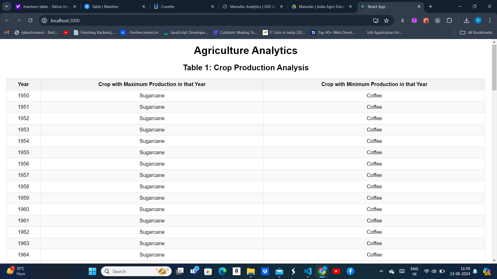
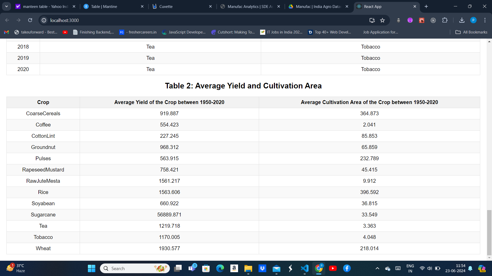

## Requirements

- Node.js (>=14.x.x)
- Yarn (>=1.x.x)

## Setup

1. **Clone the repository:**
    ```sh
    git clone https://github.com/PraveenVishvakarma/indian-agriculture-analytics.git
    cd indian-agriculture-analytics
    ```

2. **Install dependencies:**
    ```sh
    yarn install
    ```

3. **Run the application:**
    ```sh
    yarn start
    ```

    The browser should automatically open with the desired page rendered. If not, open your browser and navigate to `http://localhost:3000`.

## Project Details

### Data

The dataset used in this project is stored in `src/data/agricultureData.json`. All missing cell values are treated as 0.

### Components

- `TableComponent.tsx`: A reusable table component for displaying data.
- `App.tsx`: Main application component that processes the data and uses `TableComponent` to display two tables.

### Utilities

- `dataUtils.ts`: Contains utility functions for processing the dataset.

### Tables

- **Table 1**: Displays the crop with maximum and minimum production for each year.
    - Columns: `Year`, `Crop with Maximum Production`, `Crop with Minimum Production`
  
    

- **Table 2**: Displays the average yield and average cultivation area for each crop between 1950-2020.
    - Columns: `Crop`, `Average Yield (Kg/Ha)`, `Average Cultivation Area (Ha)`

    

## Notes

- The average values are rounded off to 3 decimal places.
- No other helper libraries like Bootstrap, jQuery, Lodash, etc., are used.
- The project is implemented using TypeScript for type safety and React for the UI.

## Author

- [Praveen Vishvakarma](https://github.com/PraveenVishvakarma)

